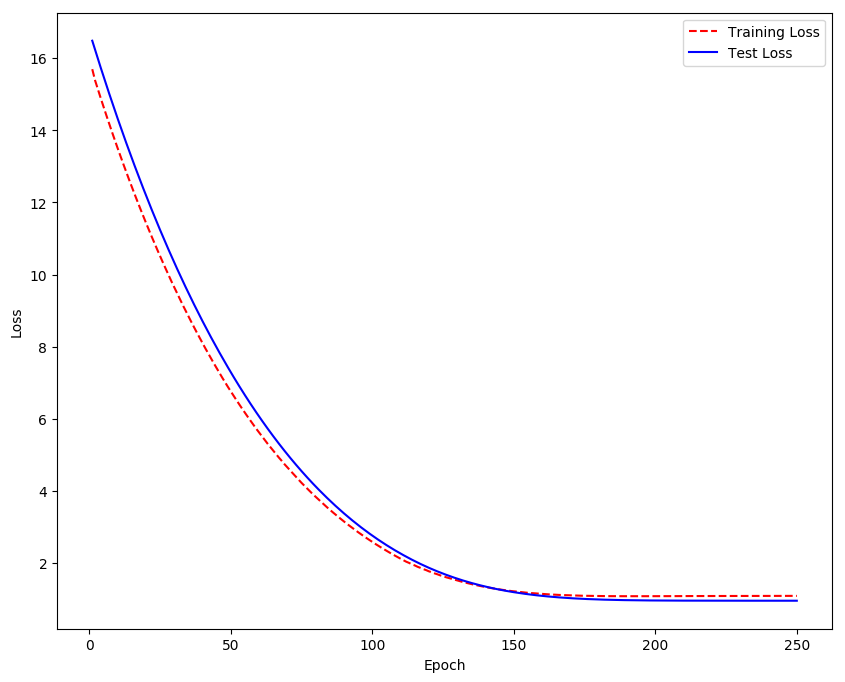

How well can a machine learning algorithm predict consumer preference in the hostile conditions of Internet reviews? Should we worry about predictive power of information we leave online? We try to answer these questions by looking into how the machine generated recommendations depends on the amount of data supplied by the user in a noisy, non-synthetic dataset. A broader description of the methodology of our project is available in `poster.pdf`.

- Either use with example subset or download [McAuley dataset](https://nijianmo.github.io/amazon/index.html)
    - A example 8K subset provided is only suitable for presentation
    - Otherwise refer to the poster and untar the tarball into `data\`
- Run `python preprocess.py` with desired parameters
- Run `python model.py` with desired parameters

>Note that this work was done in 2018 and a more complete version is available [here](https://gitlab.com/mlatlse).

